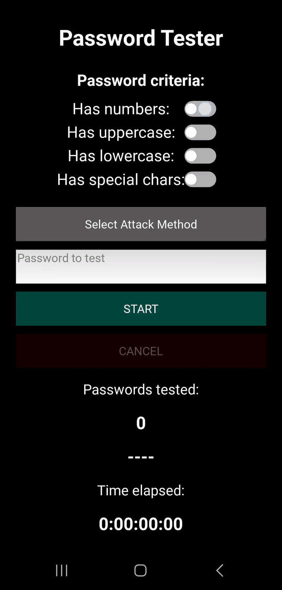

# Password Tester

<p align="center">
  
</p>

**Password Tester** is a Python + Kivy-based cross-platform app designed to demonstrate how quickly a password can be guessed using various common methods. Once the user enters a password and selects one of the three available attack methods, the app begins testing passwords in real time, displaying:

- The number of tested passwords
- The currently tested password
- The time elapsed since the test began

The goal is to provide insight into how password strength affects resistance to different types of attacks.

This application was developed as part of a university project by me and [@bb6464](https://github.com/bb6464).  
A downloadable `.apk` version for Android is available here: [Password Tester (.apk)](https://github.com/mzabron/Password-Tester/releases/tag/v1.0)

## Features

- **Brute Force Method**  
  Attempts to guess the password by generating all possible combinations of characters based on selected character types (digits, lowercase, uppercase, special characters), increasing in length over time.

- **Dictionary Method**  
  Iterates through a wordlist of 1 million of the most commonly used passwords to find a match.

- **Combined Method**  
  Enhances the dictionary approach by applying all possible common user modifications to each password, such as:
  - Appending 1–2 digits
  - Adding common special characters at the end
  - Leetspeak substitutions (`a -> 4`, `e -> 3`, etc.)
  - Duplicating the last character
  - Capitalizing the first letter

- Real-time UI updates showing:
  - Total number of tested passwords
  - Elapsed time
  - Currently tested password

- Uses **multithreading** to keep the user interface responsive during long-running operations.

- Option to cancel the guessing process at any time.

### Overview

<p align="center">
  
</p>


## How to run

1. Clone the repository:
   ```bash
   git clone https://github.com/mzabron/Password-Tester.git
   cd Password-Tester
2. Install dependecies:
   ```bash
   pip install -r requirements.txt
3. Run the application:
   ```bash
   python main.py
